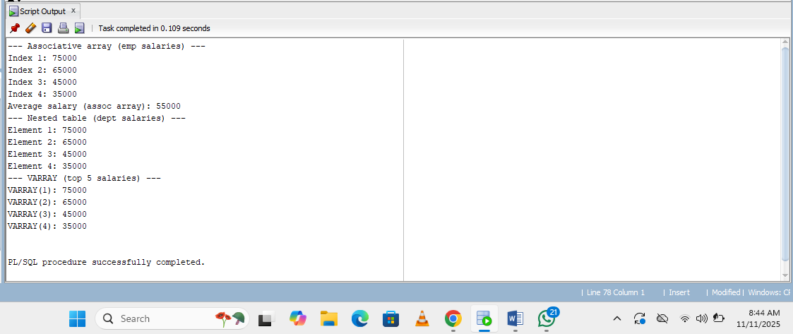

# OdryGatete_plsql_collections-records-goto

# Employee Bonus Processor using PL/SQL Collections, Records, and GOTO
# Problem Definition

In many organizations, HR often needs to calculate employee bonuses quickly and efficiently. Instead of going to the database and processing each employee’s record one by one, we can make things simpler and faster by using PL/SQL features:

First, we can load all the relevant employee data into memory as a collection. This avoids repeated trips to the database and speeds up processing.

Next, we can represent each employee as a record, which neatly organizes all their details (like name, salary, and performance score) in one place.

Finally, we can use a GOTO statement to skip over employees who don’t qualify for a bonus, keeping the logic straightforward and easy to follow.

This approach not only makes bonus calculation more efficient but also gives a clear example of how Collections, Records, and GOTO statements work together in PL/SQL.

Correction results 

Record results

